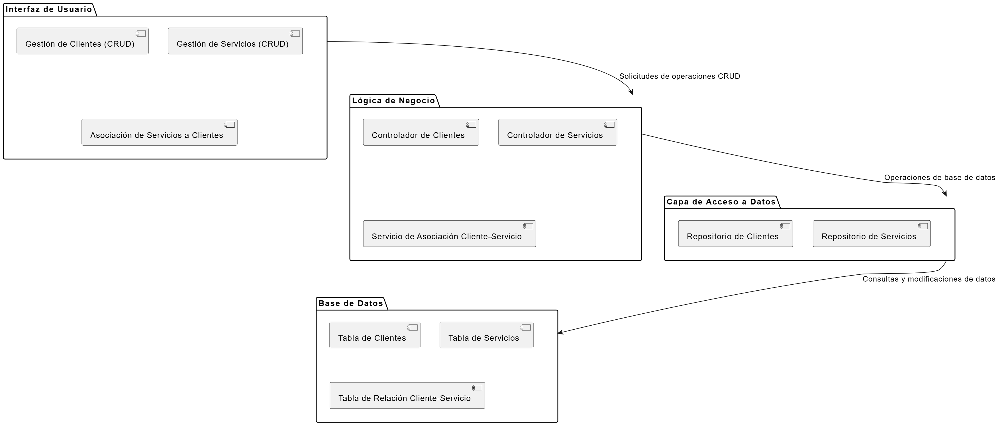

# 1. PRUEBA TÉCNICA DESARROLLO

## DESCRIPCIÓN DEL PROBLEMA

La empresa Celsia Internet S.A.S. requiere implementar una solución para su proceso de venta que permita la captura de información de los clientes y la contratación de uno o varios servicios del portafolio de internet.

El ejercicio consiste en implementar un backend y frontend con su configuración de despliegue en contenedores, para el registro y consulta de la información de los servicios contratados por los clientes, de acuerdo con el modelo de datos presentado a continuación.

## MODELO DE DATOS

Las tablas donde se almacena la información son las siguientes:

```console
CREATE TABLE clientes {
  identificacion VARCHAR(20) NOT NUL PRIMARY KEY,
  nombres VARCHAR(80) NOT NULL,
  apellidos VARCHAR(80) NOT NULL,
  tipoIdentificacion VARCHAR(2) NOT NULL,
  fechaNacimiento DATE NOT NULL,
  numeroCelular VARCHAR(20) NOT NULL,
  correoElectronico VARCHAR(80) NOT NULL
};


CREATE TABLE servicios {
  identificacion VARCHAR(20) NOT NUL,
  servicio VARCHAR(80) NOT NUL,
  fechaInicio DATE NOT NULL,
  ultimaFacturacion DATE NOT NULL,
  ultimoPago INTEGER NOT NUL DEFAULT 0,
  PRIMARY KEY (identificacion, servicio),
  CONSTRAINT servicios_FK1 FOREING KEY (identificacion) REFERENCES clientes(identificacion) ON UPDATE CASCADE ON DELETE NO ACTION
}
```

Para la prueba se deben crear las tablas en el motor de base de datos de su preferencia. Sobre esta base se deben almacenar los registros de los clientes y servicios que se especifican para la prueba.

## Puntos de la prueba

1.1. Implemente en el lenguaje de su preferencia, una `CRUD (Create, Read, Update and Delete)` que permita capturar y administrar la información de los clientes y sus servicios.

1.2. Se deben realizar las siguientes validaciones:

- No dejar datos en blanco.
- El tipo de dato, de acuerdo con la estructura en la base de datos.
- Si el registro ya existe muestre el mensaje `“El registro ya existe”`.

1.3. Implementar un formulario que permita registrar los servicios contratados de los clientes. `Nota: Tener en cuenta integridad referencial.`

1.4. Implementar un formulario para la consulta por número de identificación, la información de un cliente y los servicios que tiene contratados.

TIPS:

a. Para el campo `tipoIdentificacion` ingresar solamente los siguientes valores:

- CEDULA → CC
- TARJETA IDENTIDAD → TI
- CEDULA EXTRANJERIA → CE
- REGISTRO CIVIL → RC

b. Para el campo `servicio` ingresar solamente los siguientes tipos:

- Internet 200 MB
- Internet 400 MB
- Internet 600 MB
- Directv Go
- Paramount+
- Win+

c. Se evaluará el uso de patrones de diseño, en backend y frontend, la configuración de despliegue en contenedores y de la imagen a desplegar.

d. En el docker-compose se debe incluir la configuración del servicio de base de datos que haya escogido y una política de manejo de logs para cada servicio.

## ENTREGABLE

Se espera como resultado un clone del repositorio `https://github.com/celsia-internet/pruebas.git`, con la siguiente estructura.

```
api/
|-- docker-compose.yml
|-- Dockerfile
|-- README.md
|-- ...
webapp/
|-- docker-compose.yml
|-- Dockerfile
|-- README.md
|-- ...
```

El repositorio de la prueba deberá estar publicado en `github` de manera pública con el nombre `prueba-celsia-internet` usando git-flow por desarrollador.

```
main/
|-- develop
||-- <desarrollador>
```

# 2. PRUEBA TEORICO-PRACTICA

Para el desarrollo de la prueba teórica, tendrás que escribir tus respuestas en el archivo README.md del repositorio, tomando como referencia la aplicación desarrollada en la `PRUEBA TÉCNICA DE DESARROLLO`.

## PREGUNTAS

2.1. Elabore un diagrama de componentes de la aplicación. Debe cargar el archivo en la siguiente ruta del repositorio: `./assets/diagrama.png`



2.2. ¿Qué mecanismos de seguridad incluirías en la aplicación para garantizar la protección del acceso a los datos?

- RTA:  1 Autenticación de usuarios a dos pasos
        2 Control de acceso basado en roles
        3 Auditoría y monitoreo de logs
        4 Seguridad en las API como autenticacion y autorizacion dependiendo lo que este solicitando 
        5 Actualizaciones
        6 Monitoreo

  2.3. ¿Qué estrategia de escalabilidad recomendarías para la aplicación considerando que el crecimiento proyectado será de 1,000,000 de clientes por año?
  - RTA:  1. Arquitectura de microservicios
          2. Escalado horizontal
          4. Procesamiento asíncrono
          6. Optimización de consultas
          7. Almacenamiento en la nube
          8. Monitoreo
          9. Estrategia de caché
          10. Optimización de código
          12. Pruebas de carga

  2.4. ¿Qué patrón o patrones de diseño recomendarías para esta solución y cómo se implementarían? (Justifique)

- RTA:  1. Patrón MVC, Justificación: Este patrón ya está implícito en la estructura del diagrama.
        2. Patrón Factory, Justificación: Útil para la creación de objetos complejos como clientes o servicios.

  2.5. ¿Qué recomendaciones harías para optimizar el manejo y la persistencia de datos de la aplicación, teniendo en cuenta que esta aplicación tiene una alta transaccionalidad?

- RTA:  1. Uso de bases de datos optimizadas para transacciones
        2. Implementación de índices eficientes en bd 
        3. Uso de procedimientos almacenados
        4. Optimización de consultas
        5. Implementación de caching
        6. Arquitectura de lectura/escritura separada
        7. Manejo eficiente de conexiones
        8. Monitoreo y ajuste continuo
        9. Estrategia de backup y recuperación
        10. Uso de tecnologías NoSQL para reporteria

Estas recomendaciones ayudarán a optimizar el manejo y la persistencia de datos en un entorno de alta transaccionalidad, mejorando el rendimiento, la escalabilidad y la fiabilidad de la aplicación.

# 3. Redes

3.1. Explica la diferencia entre un router y un switch. ¿Cuándo usarías cada uno?
- RTA:  El router se encarga de manejar el tráfico de datos entre redes diferentes en casa, cuando se desea conectar a internet
        El switch trabaja dentro de una sola red local, Su trabajo es conectar varios dispositivos en la misma red y dirigir los datos entre ellosm se puede usar un switch cuando quieras ampliar una red local y conectar varios dispositivos dentro de esa misma red.

3.2. Describe las siete capas del modelo OSI y menciona brevemente la función principal de cada una
- RTA:  1 Física transmite bits a través del medio físico (cables, fibra óptica, ondas de radio)
        2 Enlace de Datos: Maneja tramas y direcciones MAC; detecta y corrige errores en la transmisión de datos. 
        3 Red: Encaminamiento de paquetes entre redes usando direcciones IP.
        4 Transporte: Garantiza la entrega correcta y fiable de datos; maneja el control de flujo y la corrección de errores (TCP/UDP).
        5 Presentación: Traduce, codifica y cifra los datos para la capa de aplicación.
        6 Aplicación: Proporciona servicios de red a las aplicaciones (HTTP, FTP, SMTP).

3.3. Explica las diferencias entre los protocolos TCP y UDP. Dar un ejemplo de cuándo usarías cada uno?
- RTA

3.4. ¿Qué es una máscara de subred y cómo se utiliza para dividir una red en subredes más pequeñas?
- RTA

3.5. ¿Puedes mencionar algunos protocolos de enrutamiento dinámico y explicar brevemente cómo funcionan?
- RTA

# 4. Gestión de Proyectos

4.1. ¿En qué grupos de procesos de dirección de proyectos es creado un presupuesto detallado del proyecto?
- RTA: en el grupo dePlanificación, durante los procesos de analisis y estimación de costos

4.2. ¿En qué grupo de procesos de la dirección de proyectos es creada el acta de constitución del proyecto?
- RTA: grupo de procesos de Inicio, Este documento da el alcance del proyecto.

4.3. El equipo de proyecto acaba de completar el primer cronograma y presupuesto del proyecto. La próxima cosa a hacer es:********\_********
- RTA: 4.3: La próxima cosa a hacer es obtener la aprobación del cronograma y presupuesto.

4.4. Un primer cronograma del proyecto puede ser creado solamente después de crear: **********\_\_\_\_**********
- RTA: 

4.5. Una persona que debe estar al mando durante la planificación de la gestión del proyecto es:************\_\_************
- RTA: el gerente del proyecto

4.6. ¿Cuál de son las entradas del grupo de procesos de inicio de un proyecto?
- RTA: 
        * Requisitos de alto nivel del software: Descripciones generales de las funcionalidades y características que el software debe cumplir.
        * Documentos de negocio: Como el caso de negocio, que justifica la necesidad del software y describe los beneficios esperados.
        * Acuerdos: Contratos o acuerdos con clientes y terceros llegado el caso.

4.7. El patrocinador del proyecto acaba de aprobar el acta de constitución del proyecto, ¿cuál es la próxima cosa a hacer?
- RTA:  identificar y asignar al equipo de planificación, la formación del equipo que ayudará a desarrollar el plan de gestión del proyecto y posteriormente, se llevarán a cabo reuniones de inicio para alinear al equipo sobre los objetivos y el enfoque del proyecto.

4.8. Acaban de ser establecidas las restricciones de alto nivel del cronograma del proyecto. ¿En qué grupo de procesos de dirección de proyectos se encuentra?
- RTA: El establecimiento de las restricciones de alto nivel del cronograma del proyecto se encuentra en el grupo de procesos de Planificación. Este proceso forma parte del desarrollo del cronograma del proyecto, donde se definen las limitaciones y condiciones que deben tenerse en cuenta al crear el cronograma detallado.

4.9. ¿Qué grupos de procesos deben ser incluidos en cada proyecto?
- RTA: Analisis,Planificación,Desarrollo y Cierre.

4.10. ¿Qué grupo de procesos de la dirección de proyecto necesita normalmente el mayor tiempo y número de recursos?
- RTA: Ejecucion o desarrollo.

# 5. Caso práctico

Celsia internet en su proceso de expansión, se ha fijado como meta un crecimiento para los proximos 5 años donde se espera tener un millon de clientes. Para el que el proceso de facturación y recaudo sea efectivo, se requiere que el sistema de liquidación mensual de procese en los tiempos de corte establecidos de acuerdo con los ciclos de facturación definidos, los servicios que han sido prestados a sus clientes y las novedades reportadas en cada periodo. Que estrategias implementaría en el desarrollo de los componentes de liquidación y facturación masiva de servicios por ciclo y el recaudo de los pagos de las factura, buscando que el sistema sea robusto, escalable, resiliente, confiable y mantenible en el tiempo, ademas de la seguridad de la infomración y el tratamiento de los datos personales de los clientes.

Describa o diseñe las estrategias que incluiría para dar solución a los requerimientos solicitados en la implementación de los componentes descritos (Justifique la priorización de ciertos atributos sobre otros atributos de calidad en la propuesta de solución).

- RTA: Para diseñar una solución efectiva para los componentes de liquidación y facturación, así como el recaudo de pagos, es importante priorizar ciertos atributos de calidad en función de los requerimientos específicos y el contexto del sistema. 
1. Arquitectura y Diseño Microservicios: Implementar una arquitectura basada en microservicios para dividir el sistema en componentes independientes (facturación, liquidación, recaudo, etc.), permitiendo escalabilidad y mantenimiento más sencillo.

2. Base de Datos y Almacenamiento
Estrategia: Bases de Datos Distribuidas: Utilizar bases de datos distribuidas y con soporte para particionamiento y replicación
Justificación:
Rendimiento y Disponibilidad: Dado el alto volumen de transacciones y datos asociados a la facturación masiva, es esencial contar con una base de datos que ofrezca alto rendimiento y alta disponibilidad

3. Resiliencia y Recuperación ante Desastres
Estrategia: Alta Disponibilidad y Plan de Recuperación: Implementar mecanismos de redundancia (como balanceo de carga y replicación de servicios) y desarrollar un plan de recuperación ante desastres que incluya respaldos regulares y pruebas de recuperación.
Justificación:
Continuidad del Servicio: Garantizar la alta disponibilidad y una recuperación rápida en caso de fallos es esencial para mantener la confianza de los clientes y cumplir con los ciclos de facturación sin interrupciones.
4. Mantenibilidad y Actualizaciones
Estrategia: Documentación y Pruebas Automatizadas
Justificación:
Facilitar el Mantenimiento: Una buena documentación y pruebas automatizadas ayudan a identificar y solucionar problemas rápidamente, y a realizar actualizaciones sin introducir errores, lo cual es vital para la sostenibilidad a largo plazo del sistema.

5. Interfaz de Usuario y Experiencia
Estrategia: Diseño Intuitivo y Soporte: Desarrollar interfaces de usuario intuitivas para la gestión de facturación y pagos, y proporcionar soporte técnico eficiente para resolver problemas y atender consultas de los usuarios.
Justificación:
Usabilidad y Soporte al Cliente: Una interfaz amigable mejora la experiencia del usuario y reduce el tiempo de capacitación necesario. El soporte efectivo ayuda a mantener la satisfacción del cliente y a resolver problemas rápidamente.

Priorización de Atributos
1. Seguridad: Es la prioridad principal debido a la sensibilidad de los datos personales y la necesidad de cumplir con regulaciones.

### Por último, y no menos importante, te deseamos mucha suerte y esperamos que disfrutes haciendo la prueba. El objetivo es evaluar tu conocimiento, capacidad de adaptabilidad y habilidad para resolver problemas.
